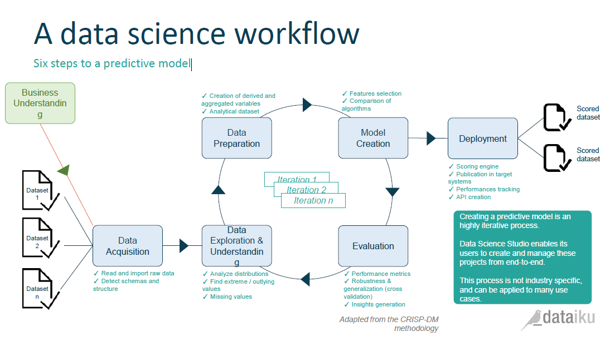

# Introduction

## Sujet et données choisies
Pour ce dernier TP du cours d'Apprentissage Statistique, nous avons décidé de relever un défi sur le site *Kaggle*, une plateforme  d'organisation web organisant des challenges de Data Science. Plus précisément, nous avons participé à une compétition pour *Airbnb*, dont le but est de prédire dans quel pays se fera la première réservation d'un nouvel utilisateur. 

Pour cela, Airbnb fournit une base de donnée d'entraînement sur un échantillon de 213 451 utilisateurs américains de Airbnb, dont des données démographiques, le web-tracking du processus de création du compte utilisateur, ainsi que les enregistrements des sessions de navigation. Il s'agit donc d'un problème d'apprentissage supervisé, avec 12 classes à prédire sur 62 096 utilisateurs. Pour plus d'information, vous pouvez vous référer au site de la compétition : <https://www.kaggle.com/c/airbnb-recruiting-new-user-bookings>.

## Démarche employée

Pour ce projet, nous avons employée la méthodologie classique *CRISP-DM* (Cross Industry Standard Process for Data Mining). Cela permet de trouver des solutions à des problèmes d'analyse de données de manière itérative. Une illustration de cette méthodologie est fournie ci-dessous par l'éditeur de logiciel Dataiku.



Ce rapport présente ainsi les résultats de plusieurs itérations de ce processus, selon les différentes étapes présentées ci-dessus. Nous discuterons en conclusion de ce rapport des pistes de travail pour améliorer nos résultats lors de futures itérations.

# 1. Chargement des données et de l'environnement de travail
Tout d'abord, nous importons les librairies R que nous allons utiliser par la suite:
```{r, message=F,warning=F, results='hide'}
lib<-c("DMwR","e1071", "nnet", "randomForest", "adabag")
sapply(lib, require, character.only = TRUE, quietly=T)
```
Ensuite, nous importons les bases de données (fournies en format CSV) en format `data.frame`, en prenant soin de spécifier les types attendus pour chaque colonne, et les tags des valeurs manquantes.
```{r}
totalclasses<-c("character","Date","character","Date","factor","numeric",rep("factor",10))
df_train<-read.csv("./Kaggle-Data/train_users_2.csv",
                   stringsAsFactors=TRUE,na.strings=c("","-unknown-"),
                   colClasses = totalclasses)
df_test<-read.csv("./Kaggle-Data/test_users.csv",
                  stringsAsFactors=TRUE,na.strings=c("","-unknown-"),
                  colClasses = head(totalclasses,-1))
#session<-read.csv(unzip("./Kaggle-Data/sessions.csv.zip"))
```

# 2. Exploration et compréhension des données

Nous avons plusieurs bases de données: le *training set* `df_train` et le *test set* `df_test`contenant les mêmes informations, sauf la variable à prédire (le pays de destination), et la base `session` contenant le log de navigation web des utilisateurs du training et test set. Les training et test sets sont séparées par date. Dans le test test, on va prédire pour tous les nouveaux utilisateurs dont les premières activités sont après 01/07/2014. Pas souci de limitation du temps de calcul, nous n'avons pas utilisé la base `session`, qui est beaucoup plus volumineuse (600MB contre 30MB). Cependant la logique serait la même, cela reviendrait à ajouter des features supplémentaires.

Intéressons nous à la structure du *training set*. Nous avons 16 colonnes : 

- Identifiant utilisateur,
- Plusieurs dates : création du compte, activation du compte, première réservation, 
- Données démographiques : genre, âge
- Données de web-tracking de création du compte : méthode de signup, langue, canal d'affiliation, fournisseur affilié, application utilisée, type de device, type de navigateur Internet
- Pays de destination (la variable à prédire)

Voici de manière simplifiée les distributions des valeurs dans le training set :
```{r}
summary(df_train)
```
Notons qu'il y a 12 modalités possibles pour le pays de destination : USA, France, Canada, Grande Bretagne, Espagne, Italie, Portugal, Pays-Bas, Allemagne, Australie, other pour "autres pays" et NDF pour "Pas de destination trouvé". On remarque que pour les données de web-tracking, il existe de nombreuses modalités avec de faibles fréquences.

# 3. Préparation des données

Tout d'abord, nous transformons les données de date en variables utilisables par un modèle d'apprentissage: le mois et jour de la semaine correspondant à la création du compte, le mois et jour de la semaine correspondant à l'activation du compte, et le nombre d'heures entre la création du compte et la première activité. 
```{r, eval=F}
date_preparation<-function(x){
  x[,"month_account_created"]<-as.factor(months(x[,"date_account_created"]))
  x[,"weekday_account_created"]<-as.factor(weekdays(x[,"date_account_created"]))
  x[,"day_account_created"]<-as.factor(format(x[,"date_account_created"],"%d"))
  x[,"timestamp_first_active"]<-as.Date(as.POSIXct(x[,"timestamp_first_active"],
                                                   format="%Y%m%d%H%M%S"))
  x[,"month_first_active"]<-as.factor(months(x[,"timestamp_first_active"]))
  x[,"weekday_first_active"]<-as.factor(weekdays(x[,"timestamp_first_active"]))
  x[,"day_first_active"]<-as.factor(format(x[,"timestamp_first_active"],"%d"))
  x[,"diff_account_active"]<-numeric(difftime(x[,"timestamp_first_active"],
                                              x[,"date_account_created"],units="hours"))
  return(x)}
df_train<-date_preparation(df_train)
df_test<-date_preparation(df_test)
```

De plus, nous allons simplifier les modalités à faible fréquence en une seule modalité, afin de simplifier le problème au niveau computationnel. Notamment, le modèle `randomForest`  ne peut prendre de facteurs avec plus de 32 modalités. Cela implique de faire une harmonisation des modalités possibles entre le training et test set. Nous choisissons le paramètre de 1/1000 pour filter les modalités de fréquence trop faible.
```{r,eval=F}
get_rare_classes<-function(df,tx){
  rare_classes<-list()
  for(r in colnames(df))  {
    if(class(df[,r])=="factor"){
      rare_classes[[r]]<-names(which(summary(df[,r])<tx*sum(!is.na(df[,r]))))}}
  return(rare_classes)}

rare_classes<-get_rare_classes(df_train,0.001)

simplify_classes<-function(df,rares_classes){
  for(r in names(rare_classes)){
    if(length(rare_classes[[r]])>1){
      otherclass<-paste(rare_classes[[r]],collapse="+")
      levels(df[,r]) <- c(levels(df[,r]), otherclass)
      df[df[,r] %in% rare_classes[[r]], r]<- otherclass
      df[,r]<-droplevels(df[,r])}}
  return(df)}

df_train<-simplify_classes(df_train,rare_classes)
df_test<-simplify_classes(df_test,rare_classes)

harmonize_levels<-function(train,test){
  for(r in colnames(test))  {
    if(class(test[,r])=="factor"){
      test[,r] <- factor(test[,r], levels=levels(train[,r]))}}
  return(test)}

df_test<-harmonize_levels(df_train,df_test)
```

Enfin, nous allons éliminer les valeurs extrêmes pour l'âge, en considérant que les utilisateurs ne peuvent pas avoir moins de 18 ans ou plus de 100 ans. Dans ce cas, nous imputons l'âge médian.
```{r, eval=F}
extreme_age <- !(df_train[,"age"] > 17 & df_train[,"age"] < 100) & !is.na(df_train[,"age"])
df_train[extreme_age,"age"] <- NA
```

Finalement, afin d'éviter de perdre l'information des individus avec des valeur manquantes, nous allons imputer sur l'ensemble du training et test set, en utilisant les k-Nearest Neighbors sur les colonnes des prédicteurs. On choisit k=10, ce qui induit un certain temps de calcul (plus de 24 heures pour le training set) mais permet d'avoir des résultats robustes.

```{r, eval=F}
Predictors<-c("gender","age","signup_method","signup_flow","language",
              "affiliate_channel","affiliate_provider","first_affiliate_tracked",
              "signup_app","first_device_type","first_browser",
              "month_account_created","weekday_account_created","month_first_active",
              "weekday_first_active","diff_account_active")
df_test_imputed<-knnImputation(df_test[,Predictors], k=10, meth="median")
df_train_imputed<-cbind(knnImputation(df_train[,Predictors], k=10, meth="median"),
                        country_destination=df_train[,"country_destination"])
```


# 4. Création des modèles d'apprentissage

Dans le cadre de nos itérations, nous avons testé de nombreux modèles avec une combinaison de paramètres. Nous reportons ici les 5 meilleurs par rapport à la performance mesurée par Kaggle sur le test set (voir section suivante). Il s'agit des classifieurs suivants :

- Naive Bayes
- Logit Multinomial
- Random Forest sans poids (300 arbres)
- Random Forest avec poids inverse des fréquences des modalités (300 arbres)
- Réseau de neurones (1 couche cachée avec 50 neurones)

L'ajout de poids au modèle Random Forest a pour but de pallier au problème de déséquilibre des classes. En effet, les analyses de distribution de la section 2 ont montré qu'une large majorité des classes à prédire dans le training set sont "US" ou "NDF". Cela entraîne de mauvaises performances de classification pour les autres "petites" classes.

A noter que le temps de calcul de chaque modèle peut aller jusqu'à plusieurs heures. Nous avons du modifier les valeurs par défaut de plusieurs modèles pour adapter le nombre maximal de poids et d'itérations. D'autres modèles ont été abandonnés à cause de temps de calcul trop longs, notamment pour le Boosting.

```{r, eval=F}
fit_naivebayes_imputed<-naiveBayes(formula_predictors,data=df_train_imputed)
fit_multinomlogit_imputed<-multinom(formula_predictors,data=df_train_imputed, 
                                    MaxNWts = 2000, maxit=1000,na.action=na.omit)
fit_randomforest_imputed<-randomForest(formula_predictors,data=df_train_imputed,
                                       na.action = na.omit, importance=TRUE,
                                       do.trace=1,keep.forest=TRUE,ntree=300)
class_weights<-1/(table(df_train[,"country_destination"])
                  /sum(table(df_train[,"country_destination"])))
fit_randomforest_weighted<-randomForest(formula_predictors,data=df_train,
                                        na.action = na.omit, importance=TRUE,
                                      do.trace=1,keep.forest=TRUE,
                                      ntree=500,classwt=class_weights)
fit_nnet_imputed<-nnet(formula_predictors,data=df_train_imputed, 
                       size=50, MaxNWts = 6000, maxit=1000, na.action=na.omit)
```

Une fois que les classifieurs ont appris du training set, nous les appliquons à notre test set. Compte tenu de la métrique d'évaluation, nous allons extraire le Top 5 des prédictions par ordre décroissant de probabilité.

```{r, eval=F}
get_top5<-function(df,x){
  paste(colnames(df)[sort(x,decreasing = T,index.return=T)$ix[1:5]],collapse=' ')}

predicted_naivebayes_imputed<-predict(fit_naivebayes_imputed,df_test_imputed,"raw")
predicted_top5_naivebayes_imputed<-strsplit(apply(
  predicted_naivebayes_imputed,MARGIN=1,
  function(x) get_top5(predicted_naivebayes_imputed,x)),split=" ")

predicted_multinomlogit_imputed<-predict(fit_multinomlogit_imputed,df_test_imputed,"probs")
predicted_top5_multinomlogit_imputed<-strsplit(apply(
  predicted_multinomlogit_imputed,MARGIN=1,
  function(x) get_top5(predicted_multinomlogit_imputed,x)),split=" ")

predicted_randomforest_imputed<-predict(fit_randomforest_imputed,df_test_imputed,"prob")
predicted_top5_randomforest_imputed<-strsplit(apply(
  predicted_randomforest_imputed,MARGIN=1,
  function(x) get_top5(predicted_randomforest_imputed,x)),split=" ")

predicted_randomforest_weighted<-predict(fit_randomforest_weighted,df_test_imputed,"prob")
predicted_top5_randomforest_weighted<-strsplit(apply(
  predicted_randomforest_weighted,MARGIN=1,
  function(x) get_top5(predicted_randomforest_weighted,x)),split=" ")

predicted_nnet_imputed<-predict(fit_nnet_imputed,df_test_imputed,"raw")
predicted_top5_nnet_imputed<-strsplit(apply(
  predicted_multinomlogit_imputed,MARGIN=1,
  function(x) get_top5(predicted_nnet_imputed,x)),split=" ")
```


## 5. Evaluation
Pour cette compétition Kaggle, Airbnb a choisi d'utiliser une métrique d'évaluation particulière, le $NDCG_k$ (Normalized Discounted Cumulative Gain) sur le Top 5 des modalités prédites par ordre de probabilité. Cette métrique est définie de la manière suivante :

$$ DCG_k=\sum_{i=1}^k\frac{2^{rel_i}-1}{\log_2{\left(i+1\right)}} $$
$$ NDCG_k=\frac{DCG_k}{IDCG_k} $$

où $rel_i$ est la pertinence du résultat à la position $i$, c'est-à-dire 1 si le bon pays est prédit, et 0 sinon. $IDCG_k$ est le maximum du $DCG_k$, ce qui permet de normaliser entre 0 et 1. Ci-dessous une implémentation simple de cette métrique à fin de cross-validation:

```{r, eval=FALSE}
dcg_at_k <- function (r, k=5) {
    r <- as.vector(r)[1:k]
    sum(( 2^r - 1 )/ log2( 2:(length(r)+1)) )} 

ndcg_at_k <- function(r, k=5) {
    r <- as.vector(r)[1:k]
    if (sum(r) <= 0) return (0)
    dcg_max = dcg_at_k(sort(r, decreasing=TRUE)[1:k], k)
    return ( dcg_at_k(r, k) / dcg_max )}


ndcg_score <- function(predicted_top5, truth) {
    predicted_top5 <- matrix(unlist(predicted_top5),ncol=5,byrow=T)
    truth <- as.vector(truth)
    stopifnot(length(truth) == nrow(predicted_top5))
    score <- apply(cbind(truth, predicted_top5), 1, function(x) ifelse(x == x[1], 1, 0))[-1,]
    if (ncol(predicted_top5) == 1) score <-rbind(score, score)  #for 1d matrices
    as.vector(apply(score, 2, ndcg_at_k) )}
```

Nous présenterons ici les résultats du $NDCG_k$ donnés par Kaggle sur le test set, en passant par le chargement de fichiers CSV spécialement préparés:
```{r, eval=FALSE}
write.csv(data.frame(id=df_test[rep(1:nrow(df_test),each=5),"id"],
          country=unlist(predicted_top5_naivebayes_imputed)),quote=F,row.names = F,
          file="submission_naivebayes_imputed.csv")
write.csv(data.frame(id=df_test[rep(1:nrow(df_test),each=5),"id"],
          country=unlist(predicted_top5_multinomlogit_imputed)),quote=F,row.names = F,
          file="submission_multinomlogit_imputed.csv")
write.csv(data.frame(id=df_test[rep(1:nrow(df_test),each=5),"id"],
          country=unlist(predicted_top5_randomforest_imputed)),quote=F,row.names = F,
          file="submission_rf_imputed.csv")
write.csv(data.frame(id=df_test[rep(1:nrow(df_test),each=5),"id"],
          country=unlist(predicted_top5_randomforest_weighted_imputed)),
          quote=F,row.names = F, file="submission_rf_imputed.csv")
write.csv(data.frame(id=df_test[rep(1:nrow(df_test),each=5),"id"],
          country=unlist(predicted_top5_nnet_imputed)),quote=F,row.names = F,
          file="submission_nnet_imputed.csv")
```

Les résultats sont reportés dans le graphique ci-dessus, par ordre décroissant de performance:
```{r fig.height=4.2, fig.width=8}
results<-sort(c("Naive Bayes"=0.83874,"Logit Multinomial"=0.85337,"Random Forest"=0.82701, 
           "Random Forest avec poids"=0.69293,"Réseau de neurones"=0.83352),decreasing=T)
plotresults<-barplot(results,ylim=c(0.66,0.88),
                     xpd=F,cex.names=0.63,cex.axis=0.63)
grid(ny=NULL,nx=1,col="darkgrey")
text(x=plotresults,y=results,labels=results, pos=3,cex=0.8)
```


On voit que le modèle le plus performant est le Logit Multinomial. On constate également que la performance de la Random Forest avec poids est très décevante. Il s'agit d'une fausse piste de solution pour le déséquilibre des classes. 

Cela nous place à la 566ème place de la compétition sur 860, sachant que la performance de la première équipe est de 0.88184 (classement au 10 janvier 2016). Les écarts entre équipes sont donc très faibles. 

# Conclusion : pour aller plus loin

Sachant que la compétition est ouverte jusqu'au 11 février, de nombreuses pistes s'offrent à nous pour améliorer les résultats de nos prédictions :

- Utiliser les données de navigation web de la base `session`, qui nous pas été intégrées jusqu'ici

- Faire de la cross-validation sur le training set pour optimiser les paramètres des modèles. Pour l'instant cela a été fait manuellement par rapport aux résultats du test set, ce qui n'est pas optimal (le scoring est limité par Kaggle à 5 par jour)

- Pallier aux problème de déséquilibre des classes en sur-échantillonant les petites classes (ou inversement en sous-échantillonant les grandes classes)

- Implémenter de nouveaux modèles plus puissants comme le Boosting, Bagging et les Deep Neural Networks

- Aggréger l'ensemble des classifieurs (blending)
